## Sandbox escape via c.a.f.netfs.PlugInLibraryService

#### Apple description for CVE-2026-28827
> A parsing issue in the handling of directory paths was addressed with improved path validation.

This was one of the issues I discovered before the security release. Unfortunately, while I was still writing the report, another researcher submitted it first. Even so, I wanted to diff the patch to understand how Apple fixes bugs in this class, and the result was genuinely surprising.

--- 
#### Root cause

`PlugInLibraryService` is an application XPC service that is part of `NetFS.framework`. It is reachable from a sandboxed context once it is registered in the PID domain; for additional background, see ["A New Era of macOS Sandbox Escapes"](https://jhftss.github.io/A-New-Era-of-macOS-Sandbox-Escapes).

More importantly, the service has no entitlements and does not call initialization routines such as `_sandbox_init_with_parameters`. In other words, it runs in an unsandboxed context, which is confirmed both by `sandbox_check` and by process monitor output.

The service also does not validate the client context, such as entitlements or the audit token, in the relevant `ServiceDelegate` selector.

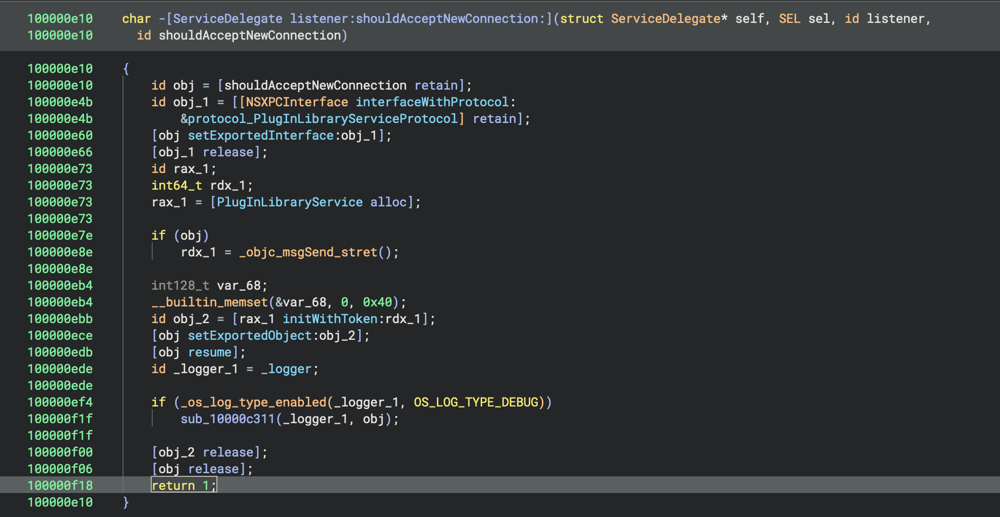

Overall, the declared protocol exposes a fairly broad attack surface:
```
startUp:withReply:
getLibraryEntryInfo:withReply:
getMountInfo:withReply:
createURL:withReply:
parseURL:withReply:
createSessionRef:withReply:
openSession:handle:sessionOptions:withReply:
cancel:withReply:
closeSession:withReply:
getServerInfo:handle:options:withReply:
enumarateShares:options:withReply:
(Actually, has sandbox check) mount:shareURL:mountOnPath:mountOptions:withReply
```

In this case, the interesting selector is `createSessionRef`. It takes an `NSString` containing a protocol name such as `http` and passes it to `_FindPluginByScheme`.

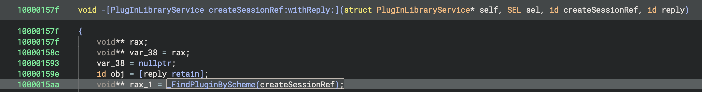

That function then calls `FindPluginBySchemeInLibrary` in two variants: one with the `/Library/Filesystems/NetFSPlugins` prefix (`aux_loc`) and one with `/System/Library/Filesystems/NetFSPlugins` (`sys_loc`).

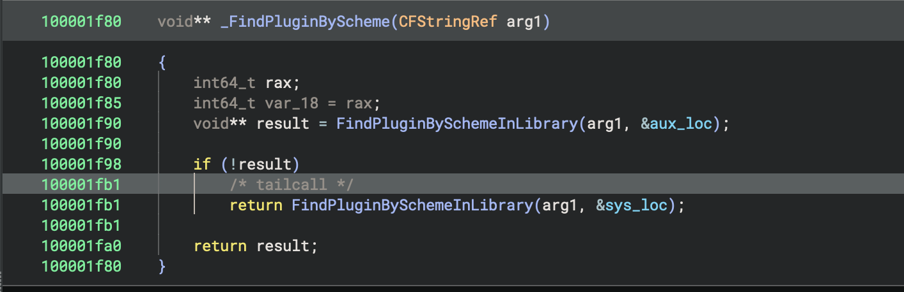

Next, attacker-controlled input is concatenated with the current prefix and extended with a `.bundle` suffix via `snprintf`. The resulting string is then passed to `LoadPlugin` (sic).

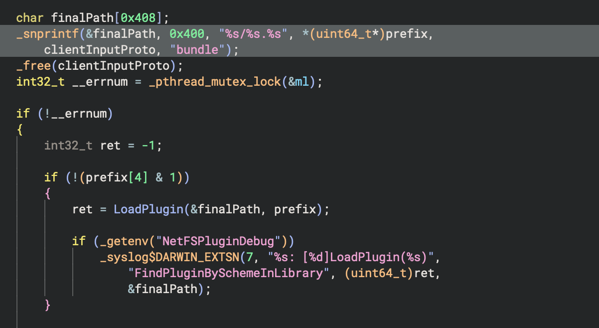

This is a straightforward path traversal. For example, specifying the protocol `"../../../../tmp/http"` makes the final lookup resolve to `"/tmp/http.bundle"`. If necessary, the `.bundle` suffix can also be neutralized with a `'./'` pattern because `snprintf` is limited to a `0x400`-byte buffer, although that detail is not especially useful for this specific bug.

`LoadPlugin` contains a second issue: `_SecStaticCodeCheckValidityWithErrors` is only invoked for the `aux_loc` case. As a result, the `sys_loc` path reaches `CFPlugInCreate` without any validation.

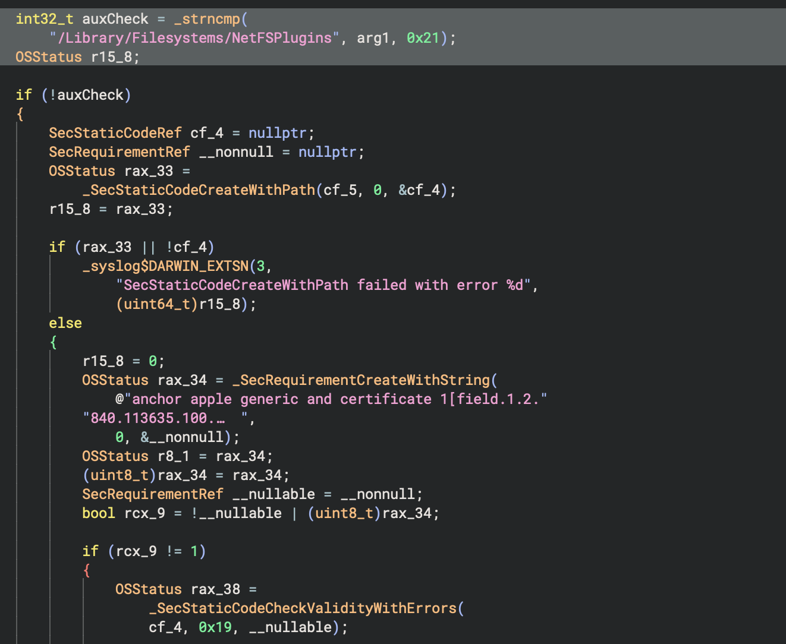
> `_SecStaticCodeCheckValidityWithErrors` is only requested when the path starts with `aux_loc`

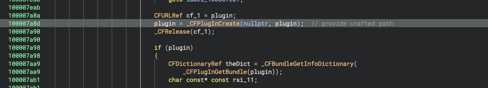
> `CFPlugInCreate` is reached with an arbitrary bundle

A quick analysis of `CFPlugInCreate` shows that it uses `dlopen` under the hood to load a library from the supplied bundle. It then resolves the dynamic registration function with `dlsym` and eventually calls it through `___CFPLUGIN_IS_CALLING_OUT_TO_A_DYNAMIC_REGISTRATION_FUNCTION__`. The flow is shown below:

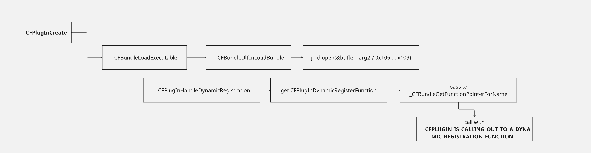

There is also an alternative route: instead of relying on the dynamic registration function, you can provide your own factory function, which is resolved in a similar way inside `CFPlugInInstanceCreate`. That is the approach I used in the proof of concept.

The end result is ACE in an unsandboxed context, since we can invoke an arbitrary function by choosing any exported symbol from a target library as the DRF or factory function.

#### Patch fix details

Apple fixed this issue not by changing the logic in `FindPluginBySchemeInLibrary` or `LoadPlugin`, but by disabling system plugin loading through `sys_loc`. In BinDiff, the patch comes down to changing the operand of a `test` instruction from `0x1` to `0x3`, which is easy to miss, especially when the diff also contains many unrelated changes in the service, the plugins, and CoreFoundation itself.

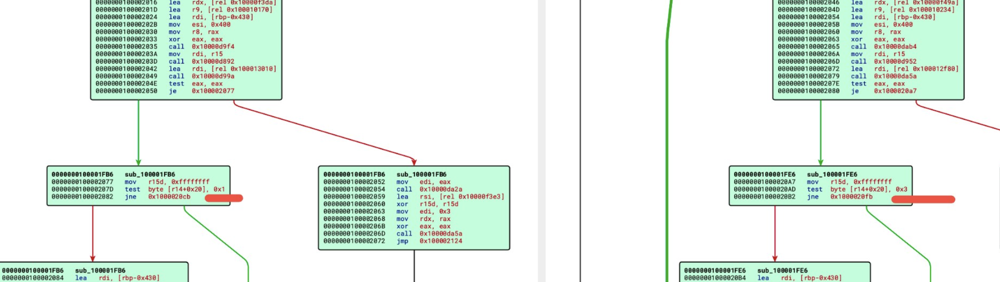 

To make the patch clearer, it helps to understand that each location appears to have its own instance of a structure containing state flags and the corresponding path.

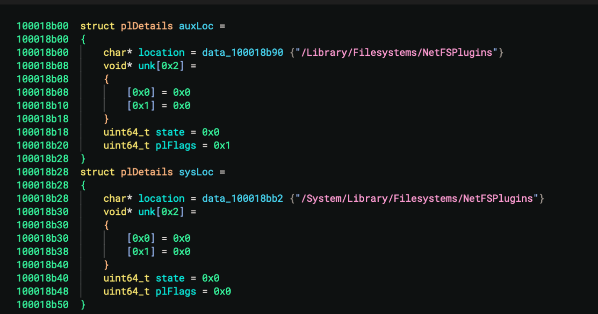

During service initialization, the following flags are set for `sys_loc`:

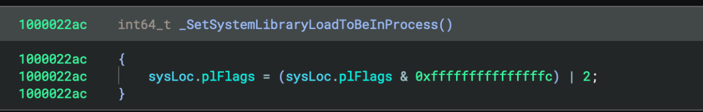

Right before the call to `LoadPlugin`, Apple inserted the modified check that now also covers state `2`. Since `sysLoc.pflFlags` does not appear to change anywhere else in the service, my conclusion is that this functionality is now permanently disabled. That said, I would not rule out regressions in the future.

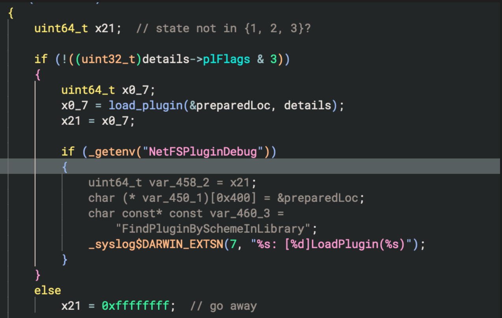

--- 

#### Lessons learned

1. A patch does not necessarily introduce or remove basic blocks or jumps.
2. The probability of a collision in vulnerability disclosure is low, but never zero. In any case, a collision is not a reason to get discouraged :)
