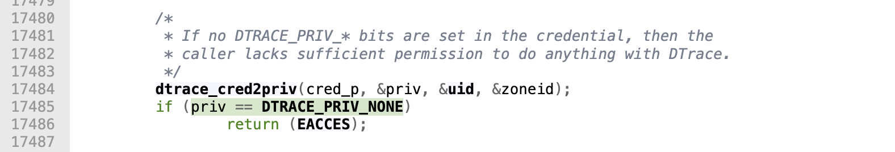
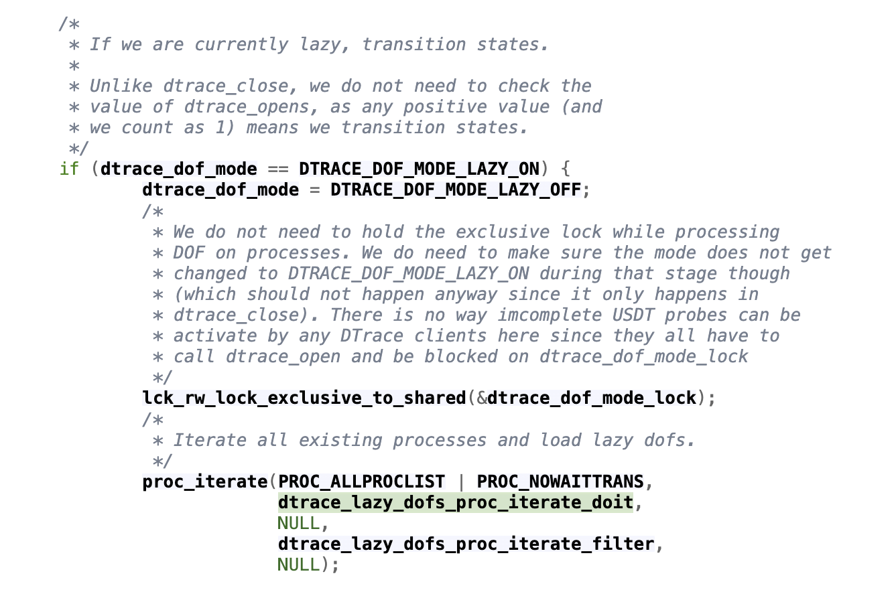
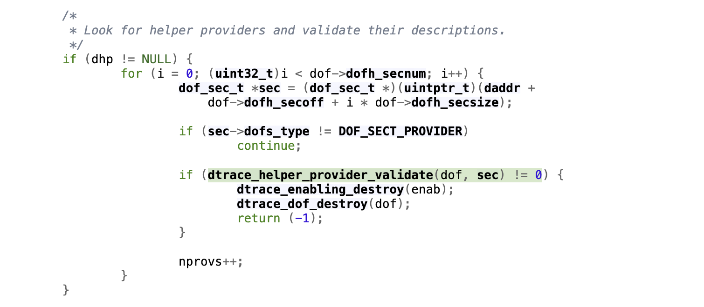
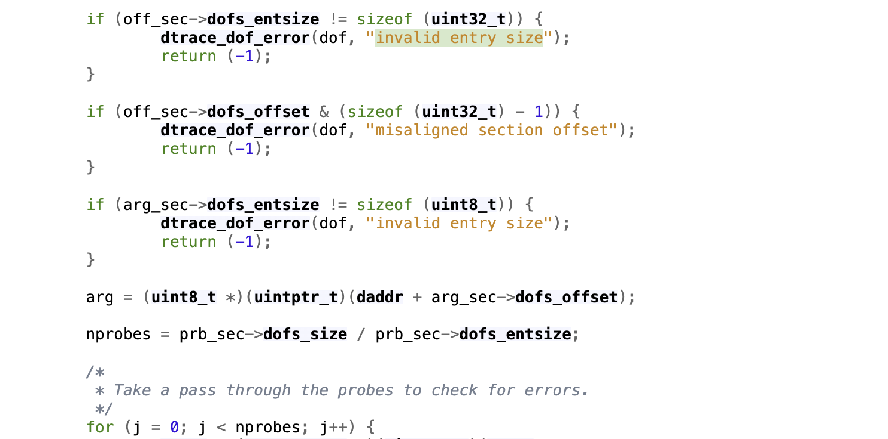
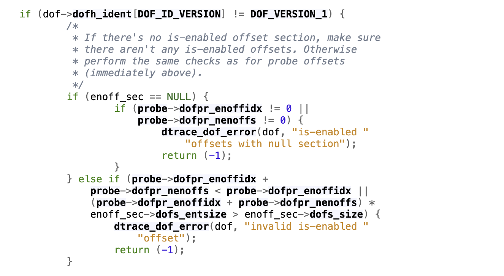
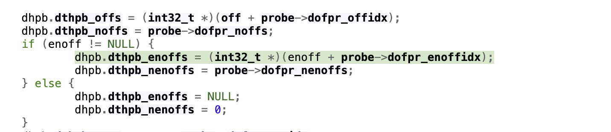
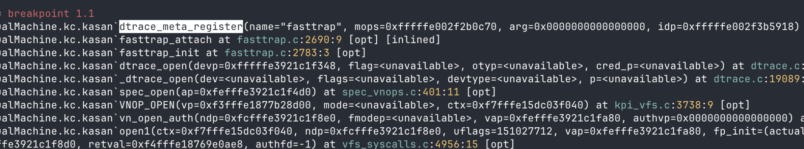
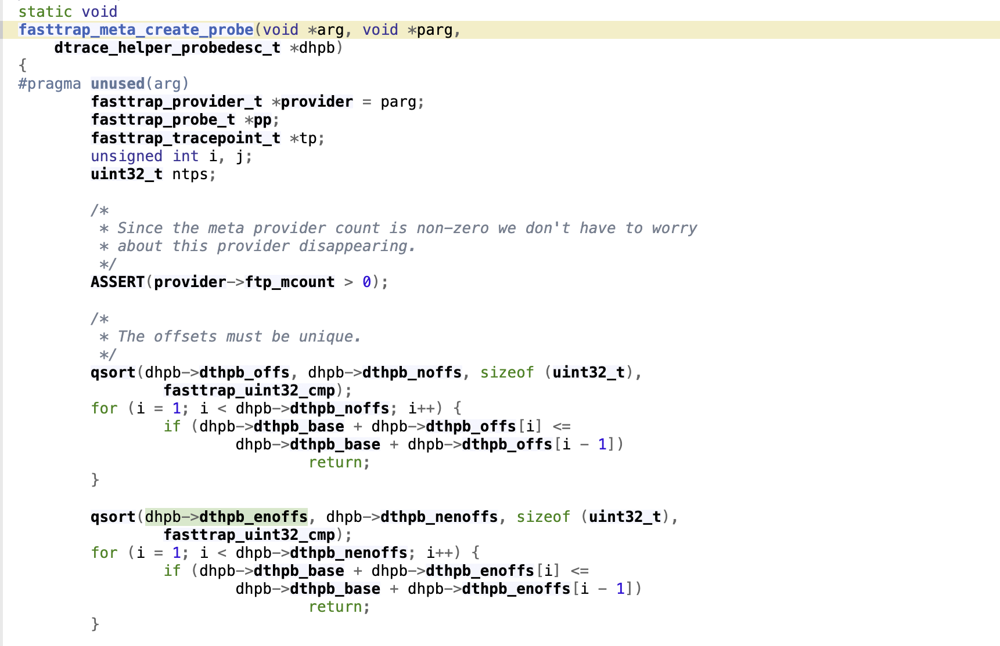
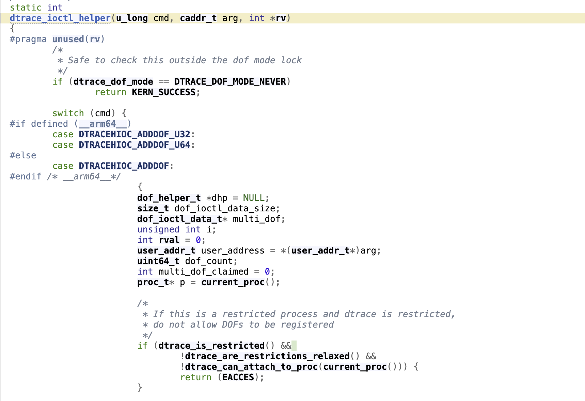
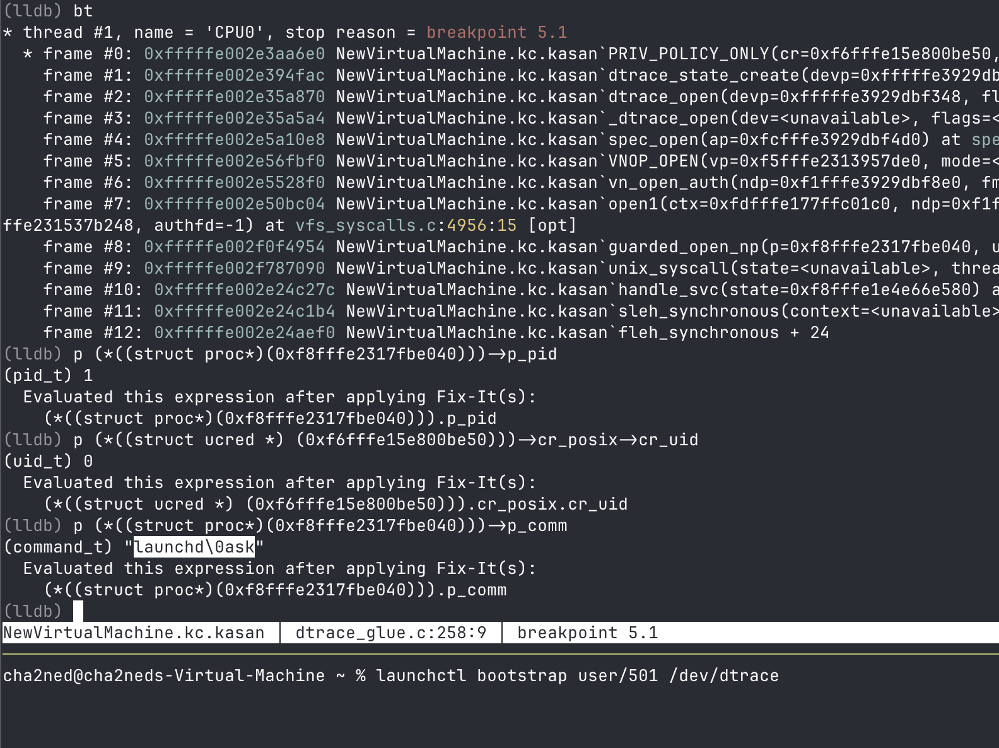

## Kernel memory corruption in DTrace DOF helper parsing

**TLDR**: a local unprivileged attacker can stage a crafted DOF through /dev/dtracehelper and later trigger DTrace lazy DOF processing from a root-context /dev/dtrace open (through confused deputy). Due to insufficient provider-section validation and integer overflows in offset range checks, attacker-controlled DOF indices are accepted and later used as out-of-bounds
kernel pointers, leading to memory corruption in the fasttrap qsort path.

Tested on macOS Tahoe 26.2 (25C56), 26.4.1 (25E253), and 26.5 (25F71). Fixed on *OS 26.5.2 with CVE-2026-39868 assigned.

---

#### Root cause

`dtrace_open` is the open handler for `/dev/dtrace`. It starts by calling `dtrace_cred2priv` and rejects the request if the caller receives `DTRACE_PRIV_NONE`. A process opening the device with UID 0 gets non-zero DTrace privileges. Remember that fact :)



After this check, `dtrace_open` changes `dtrace_dof_mode` from `DTRACE_DOF_MODE_LAZY_ON` to `DTRACE_DOF_MODE_LAZY_OFF` and begins processing lazy DOFs belonging to existing processes.



The relevant path is:

```text
dtrace_open
  dtrace_lazy_dofs_proc_iterate_doit
    dtrace_lazy_dofs_process
      dtrace_dof_copyin_from_proc
        dtrace_helper_slurp
```

`dtrace_lazy_dofs_proc_iterate_doit` is an adapter for `dtrace_lazy_dofs_process`. For every object in `p_dtrace_lazy_dofs`, the latter copies the DOF from the original process's address space, prepares the helper state, and passes it to `dtrace_helper_slurp`.

Inside `dtrace_helper_slurp`, every `DOF_SECT_PROVIDER` section is passed to `dtrace_helper_provider_validate`. The remaining helper code trusts the result of this function!



A provider section is a descriptor containing indices of other sections in the same DOF: the string table, probes, argument mappings, regular probe offsets (`PROFFS`), is-enabled offsets (`PRENOFFS`), and the provider attributes.

The first bug is in the way the two offset sections are validated. For `PROFFS`, the validator requires `dofs_entsize == sizeof(uint32_t)`. No equivalent check is made for `PRENOFFS`.



For a non-v1 DOF with `dofpv_prenoffs != DOF_SECT_NONE`, the referenced `PRENOFFS` section is resolved and its attacker-controlled `dofs_entsize` is used in the probe range check:



As a result, setting `enoff_sec->dofs_entsize` to zero bypasses validation of `dofpr_enoffidx` and `dofpr_nenoffs`. For example, `dofpr_enoffidx = 0x3ffffffe` and `dofpr_nenoffs = 2` pass with any non-zero `enoff_sec->dofs_size`, even when the claimed range extends beyond both the section and the complete DOF.

The same range check contains a separate integer overflow. It first verifies that the count does not wrap the index, but the multiplication by `dofs_entsize` is also performed in 32-bit arithmetic. The `PROFFS` PoC uses `dofpr_offidx = 0x3fff0001` and `dofpr_noffs = 0xffff`, so:

```text
(dofpr_offidx + dofpr_noffs) * dofs_entsize
= (0x3fff0001 + 0xffff) * 4
= 0x100000000
= 0 in uint32_t arithmetic
```

The addition remains valid, but the multiplication wraps to zero and the out-of-bounds range is accepted. The analogous check for `PRENOFFS` has the same integer-overflow problem even if its entry size is set correctly.

After validation, `dtrace_helper_provider_add` creates a `dhp` object containing the copied DOF address and its generation, then stores it in `p->p_dtrace_helpers`. `dtrace_helper_provider_register` later calls `dtrace_helper_provide` for each `dhp`; this function walks the already-validated provider sections and calls `dtrace_helper_provide_one`.

This is where the bad indices become kernel pointers. `dtrace_helper_provide_one` obtains `daddr`, the kernel address of the copied DOF, resolves the base of the `PROFFS` and `PRENOFFS` sections, and initializes `dthpb_offs` as `off + dofpr_offidx` and `dthpb_enoffs` as `enoff + dofpr_enoffidx`.



Both bases are `uint32_t` arrays, so the pointer arithmetic uses 4-byte elements regardless of the `dofs_entsize` value that was used during validation. A sufficiently large index therefore places `dthpb_offs` or `dthpb_enoffs` outside the DOF allocation.

The resulting descriptor is passed to `mops->dtms_create_probe`. The `mops` table belongs to `dtrace_meta_pid`; debugging shows that `fasttrap` registers these operations while `/dev/dtrace` is being opened:

```text
dtrace_open
  fasttrap_init
    fasttrap_attach
      dtrace_meta_register
```



For `fasttrap`, `dtms_create_probe` resolves to `fasttrap_meta_create_probe`. At the beginning of the function, both attacker-influenced arrays are sorted with `qsort`.



In the `PRENOFFS` PoC, `dthpb_nenoffs` is two. `qsort` reads two adjacent 32-bit values at the out-of-bounds address and, if they are not already in ascending order, swaps them. This gives a conditional swap of two existing words at a location largely controlled by `dofpr_enoffidx`. The `PROFFS` PoC reaches the same function with `dthpb_noffs = 0xffff`, producing a much larger out-of-bounds sort.

To reach this code, the attacker first needs to place a crafted object in `p_dtrace_lazy_dofs`. `/dev/dtracehelper` is accessible without additional privileges because `helper_open` always returns zero. An application without `CS_RESTRICT` also passes `dtrace_can_attach_to_proc(current_proc())`, after which `DTRACEHIOC_ADDDOF_U64` reaches `dtrace_lazy_dofs_add`. If the mode is still `DTRACE_DOF_MODE_LAZY_ON`, the supplied DOF is appended to the current process's lazy list.




---

The second condition is a UID 0 open of `/dev/dtrace`. I used `launchctl bootstrap user/<uid> /dev/dtrace`.

The corresponding user domain must exist. `launchd` accepts the supplied path and calls `guarded_open_np` on it from its own UID 0 context, which is enough to enter `dtrace_open` with non-zero privileges.



I do not think this `launchd` behavior is particularly interesting as a standalone issue, but it works well as a confused-deputy gadget here.

That's it! For more details check PoCs :)
