# Kernel heap OOB write in the ANE direct path

**TL;DR:** `ANE_ProgramSendRequest` accepts up to `0xff` IOSurfaces in total across inputs, outputs, and weights. However, `ANEHWDevice::ANE_ProgramCheckandPrewireBuffers_gated` allocates space for only `0x80` buffer descriptors. The function writes one `0x10`-byte record per surface before checking the table's actual capacity, so any request with more than `0x80` buffers corrupts the `data.kalloc.3072` heap zone.

The direct-path user client is reachable from a sandboxed process on both iOS and macOS and does not require any dedicated entitlements.

Tested on:

- iPhone18,4 running iOS 26.4.1 (`23E254`) and iOS 26.5.1 (`23F81`)
- Mac15,13 running macOS 26.5.1 (`25F80`)

Assigned **CVE-2026-43748**.

---

## Root cause

The vulnerable selector is exposed by `H11ANEInDirectPathClient` (`H1xANELoadBalancerDirectPathClient`). When the client is created, `clientKind` is set to `kANEClientKindDirectPath`. The usual IOKit and data-chaining access checks are not required for `ANE_ProgramSendRequest`.

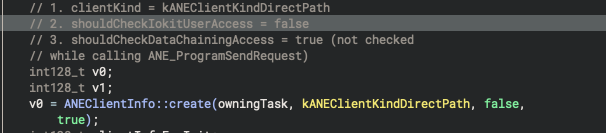

`ANE_ProgramSendRequest` takes a fairly large structured input. Among other things, it contains the IOSurfaces used for model inputs and outputs, their symbol indices, and the corresponding buffer counts. After some basic validation, the selector forwards the request to `ANEClientDevice::programSendRequest`.

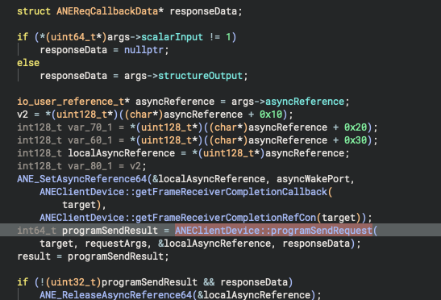

`ANEClientDevice::programSendRequest` is mostly a thin adapter around the provider's `ANE_ProgramSendRequest` method.

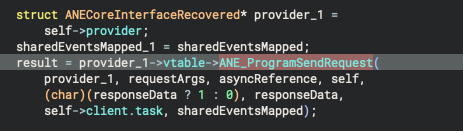

The first relevant checks happen in `ANEHWDevice::ANE_ProgramSendRequest`. The function begins by checking whether adding `totalInputBuffers` and `totalOutputBuffers` would overflow.

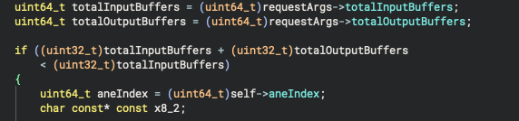

It then requires both counts to be non-zero and their sum to remain below `0x100`.

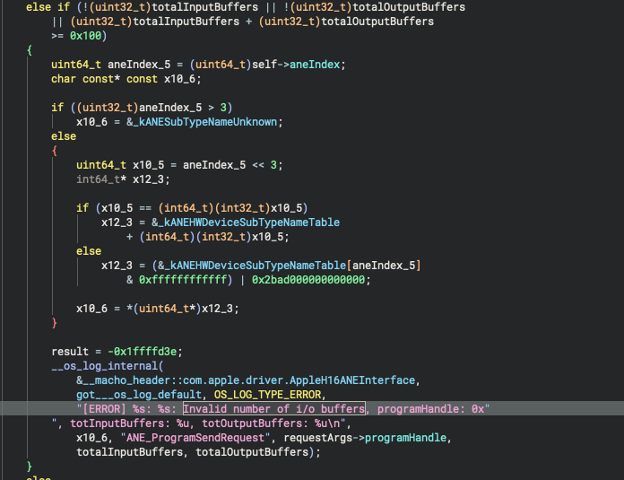

Once those checks pass, the driver resolves every supplied surface ID through `IOSurfaceRoot::lookupSurface` and stores the resulting objects in separately allocated input and output arrays.

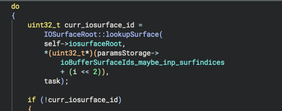

The request eventually enters the gated path:

```text
ANE_ProgramSendRequest
  ANEClientDevice::programSendRequest
    ANEHWDevice::ANE_ProgramSendRequest
      ANEHWDevice::ANE_ProgramSendRequest_gated
        ANEHWDevice::ANE_ProgramSendRequestInitialChecksAndLookups_gated
        ANEHWDevice::ANE_ProgramCheckandPrewireBuffers_gated
```

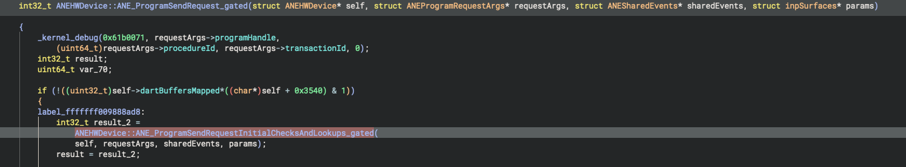

`ANE_ProgramSendRequestInitialChecksAndLookups_gated` validates the IOSurfaces and their protection settings, reconciles the input and output counts with the procedure being executed, and finally checks the complete buffer count, including weights:


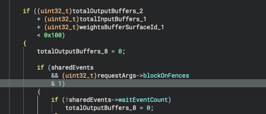

The corresponding error message identifies `0xff` as `kANEMaxBuffers`. In other words, a request may contain as many as `0xff` buffers in total.

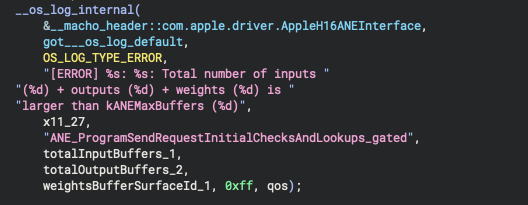

That limit does not match the allocation made later in `ANEHWDevice::ANE_ProgramCheckandPrewireBuffers_gated`.

This function creates `memoryMapRequest`, a descriptor table used to prewire the supplied IOSurfaces. `_IOMallocTypeImpl` allocates only `0x820` bytes for the object, placing it in the `data.kalloc.3072` zone.

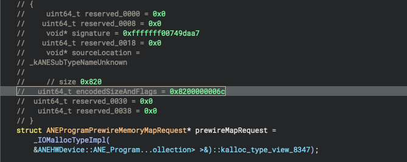

The reconstructed layout makes the intended capacity clear: `0x800` bytes are reserved for `0x80` records of `0x10` bytes each, while the remaining `0x20` bytes hold request metadata.


```cpp
struct ANEProgramPrewireMemoryMapEntry {
    uint32_t surfaceId;
    uint32_t symbolIndex;
    uint32_t mapFlags;
    uint32_t direction;
};

struct ANEProgramPrewireMemoryMapRequest {
    ANEProgramPrewireMemoryMapEntry entries[0x80];
    ANEClientDevice *clientDevice;
    uint64_t programHandle;
    uint32_t bufferCount;
    uint32_t procedureId;
    uint64_t mappedHandle;
};
```

This is where things go wrong. Immediately after allocating the object, the driver starts filling `entries` without first checking whether the supplied count fits. The loop below writes one descriptor for every input surface, and a nearly identical loop handles the outputs afterward.

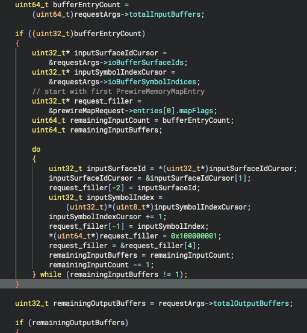

Every record after index `0x7f` is therefore written out of bounds. Because the earlier validation permits up to `0xff` buffers, the largest possible overwrite is roughly:

```text
(0xff - 0x80) * 0x10 = 0x7f0 bytes
```

The first out-of-bounds records overwrite the request's own metadata and then the allocator padding. At index `0xc0`, the destination reaches offset `0xc00`:

```text
0xc0 * 0x10 = 3072
```

At that point, the write crosses into the next `data.kalloc.3072` chunk.

The panic produced by the PoC confirms the corruption:

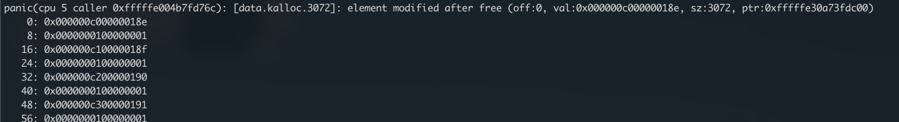

The values found in the adjacent freed chunk match the descriptor layout written by the loop: `surfaceId = 0x18e`, `symbolIndex = 0xc0`, followed by `mapFlags` and `direction`.

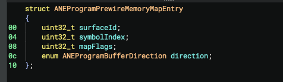

The driver actually contains the correct `bufferCount < 0x80` check. It simply performs it too late, inside `ANEHWDevice::ANE_MemoryMapRequest_gated`, after the descriptor-building loops have already corrupted memory.

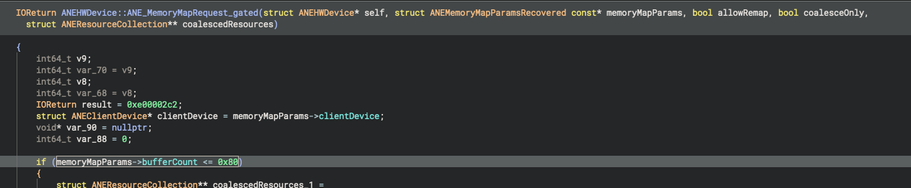

So, the bug comes down to two closely related mistakes:

1. `kANEMaxBuffers` allows up to `0xff` buffers, while `memoryMapRequest` has room for only `0x80` entries.
2. The check against the real table capacity happens after the writes instead of before them.

## PoCs

Separate PoCs are available for [macOS](pocs/macos_poc/) and [iOS](pocs/ios_poc/).

The macOS version uses a pre-crafted MIL program with 254 inputs and one output. Before evaluating the program, the PoC sprays pairs of inline Mach messages into the same heap zone and frees the first message from each pair to create holes. It then triggers the ANE request and scans the remaining messages for modifications.

The iOS project includes a compiled Core ML model with the same 254-input, one-output layout. It repeatedly runs inference until the corruption results in an MTE-related panic.

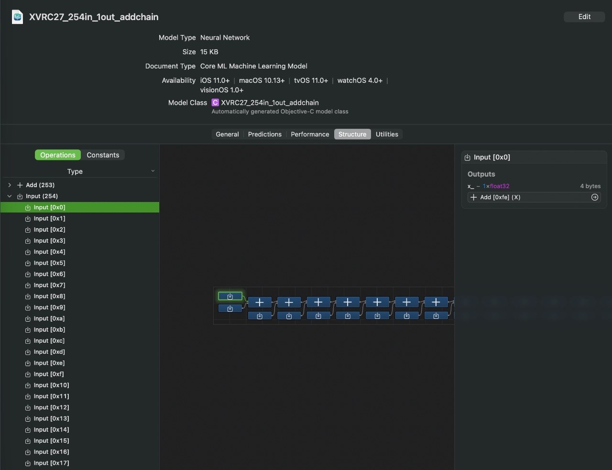
