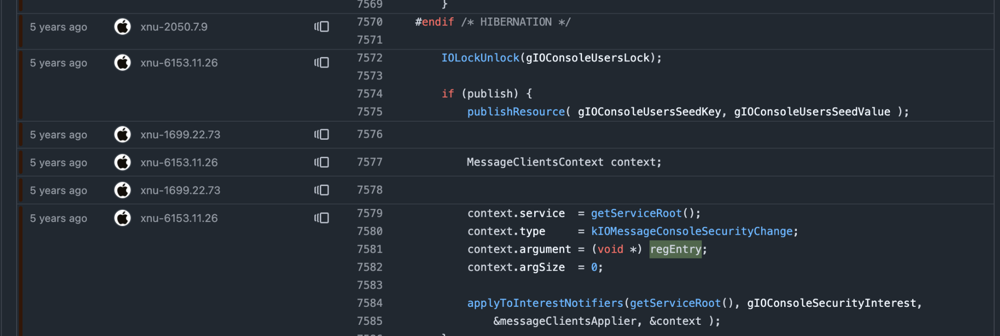
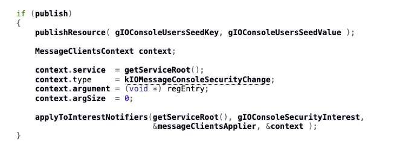
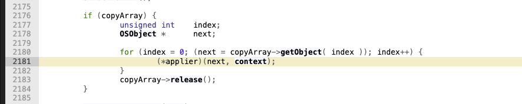
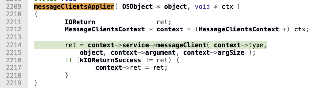
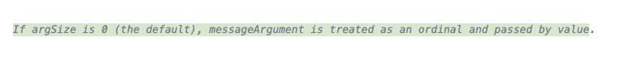
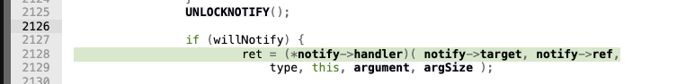
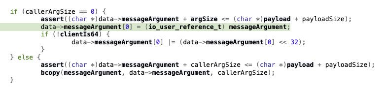
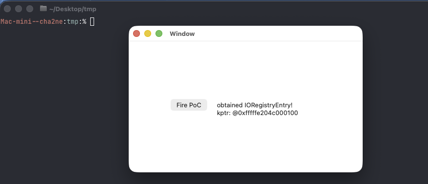

## Kernel address leak in IOService::updateConsoleUsers

Tested on macOS Tahoe 26.3.1 (25D2128) and 26.4 (25E246). Fixed on *OS 26.6.

The bug itself is quite straightforward, although the pointer passes through several IOKit wrappers before it reaches user space. All source locations below correspond to `xnu-12377.61.12`; the same pattern appears to have existed since approximately `xnu-1699.22.73`.



---

#### Root cause

Let's start with `IOService::updateConsoleUsers`. Besides publishing the current console-user state, this function prepares a `MessageClientsContext` and sends `kIOMessageConsoleSecurityChange` to the notifiers registered for `gIOConsoleSecurityInterest` (`IOService.cpp:7584`).




As we can see, `context.argument` contains the kernel VA of the `gRegistryRoot` instance. The important part is the combination of this value with `context.argSize = 0`.

`applyToInterestNotifiers` is an intermediate helper. It obtains each notifier associated with `gIOConsoleSecurityInterest` and invokes the supplied applier with the original context (`IOService.cpp:2181`).



Here the applier is `messageClientsApplier`. It unpacks the structure and calls `context->service->messageClient`, passing `context->type`, the current notifier object, `context->argument`, and `context->argSize` (`IOService.cpp:2214`).



At this point, `messageArgument` is still `regEntry` and `argSize` is still zero. The comment for the virtual `messageClient` method at `IOService.h:1475` explains the special meaning of this combination: if `argSize == 0`, `messageArgument` is treated as an ordinary value and passed by value.



The default implementation follows this contract and calls the handler stored in `_IOServiceInterestNotifier`, passing `argument` and `argSize` without modification (`IOService.cpp:2128`).



For a userspace interest notification, this handler belongs to `IOServiceMessageUserNotification`. While preparing the Mach message, `kernel_mach_msg_send_with_builder_internal` handles the zero-size case as follows (`IOUserClient.cpp:1239`):

```cpp
if (callerArgSize == 0) {
    data->messageArgument[0] =
        (io_user_reference_t)messageArgument;
} else {
    bcopy(
        messageArgument,
        data->messageArgument,
        callerArgSize);
}
```



Instead of copying data from an address supplied in `messageArgument`, the first branch copies the argument itself. In this path that argument is `gRegistryRoot`, so its kernel address becomes part of the message delivered to the notification client.

The resulting call chain is:

```text
IOService::updateConsoleUsers
  applyToInterestNotifiers
    messageClientsApplier
      IOService::messageClient
        IOServiceMessageUserNotification::handler
          kernel_mach_msg_send_with_builder_internal
```

The PoC registers exactly this type of notification. It looks up `IOPlatformExpertDevice`, creates an `IONotificationPort`, attaches its run-loop source, and then calls:

```objc
IONotificationPortRef np =
    IONotificationPortCreate(kIOMainPortDefault);
CFRunLoopAddSource(
    CFRunLoopGetCurrent(),
    IONotificationPortGetRunLoopSource(np),
    kCFRunLoopDefaultMode);

IOServiceAddInterestNotification(
    np,
    svc,
    "IOConsoleSecurityInterest",
    callback,
    NULL,
    &nf);

system("/usr/bin/open -a "
       "/System/Library/CoreServices/ScreenSaverEngine.app");
CFRunLoopRun();
```

`IOServiceAddInterestNotification` adds an `IOServiceMessageUserNotification` to the list consumed by `updateConsoleUsers`. `ScreenSaverEngine` is one convenient way to change the console-user state, although it is not the only possible trigger.

When the message arrives, the callback displays its `messageArgument` parameter and stops the run loop. It then releases the notification object and service and destroys the notification port. The project has App Sandbox enabled in both build configurations, with a macOS 26.2 deployment target.



The recorded run was made on macOS 26.4 (25E246), using a T6041 kernel built from `xnu-12377.101.15`. The returned value was `0xfffffe204c0c0010`, matching the kernel address passed through the path above. Semantically, this is similar to CVE-2020-3836, where a kernel pointer was also copied directly to user space.
