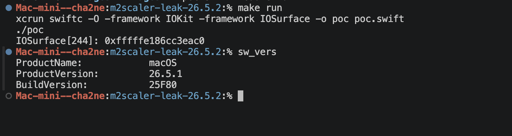
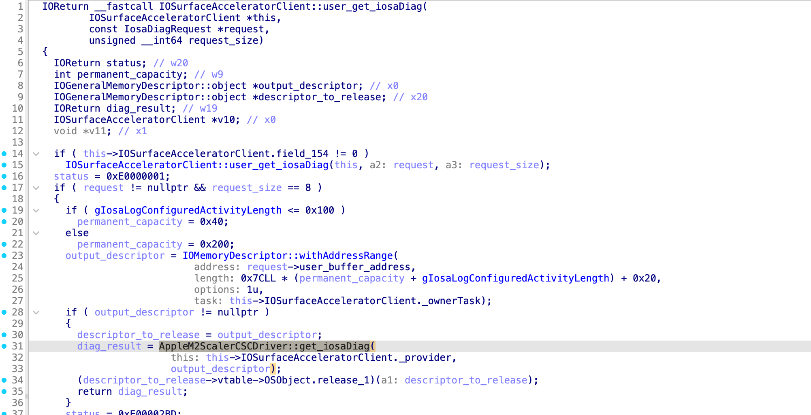
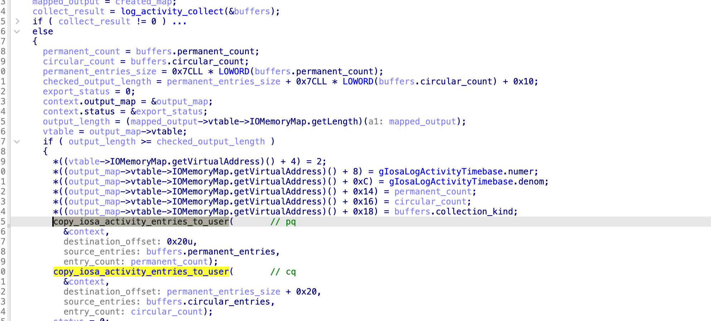
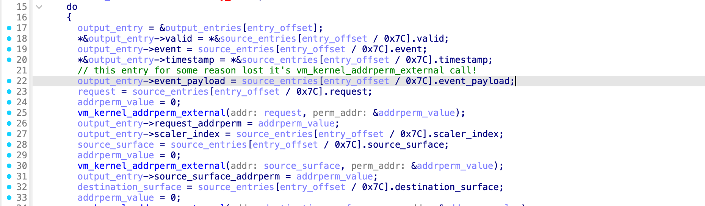
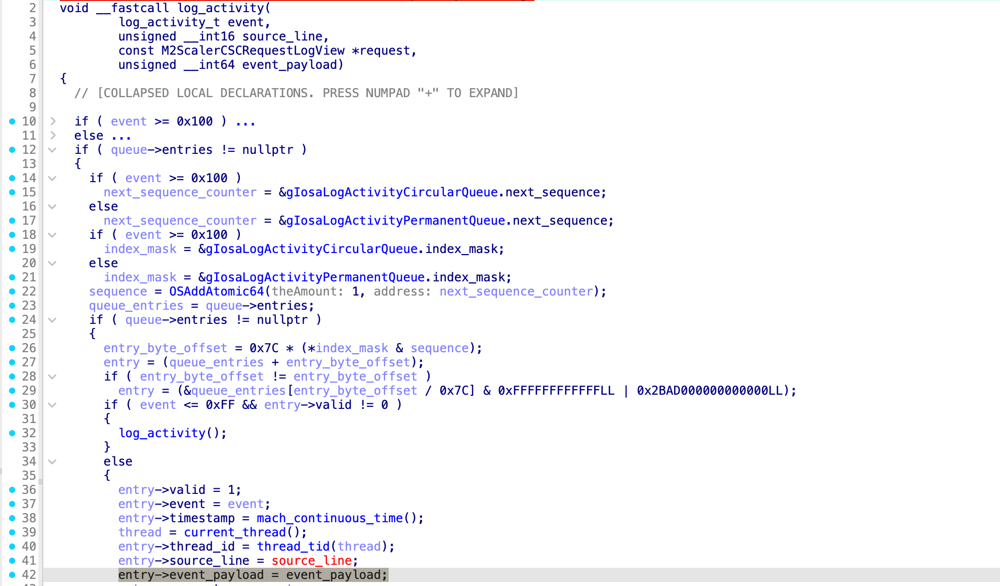
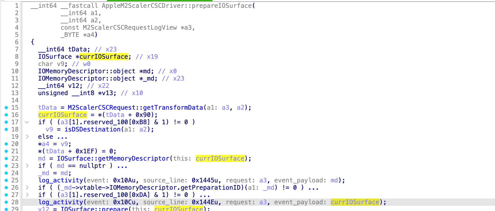

## Leak of a specified IOSurface kernel address via AppleM2ScalerCSCDriver::get_iosaDiag_gated

TL;DR: In one of the affected releases (<= 26.5.2), Apple removed the `vm_kernel_addrperm_external` call for the log-entry field at offset 0x18 in the helper called by `AppleM2ScalerCSCDriver::get_iosaDiag_gated`. This field is `event_payload`, which is populated from the fourth argument of `log_activity`. An attacker can trigger a call with an attacker-controlled IOSurface pointer in `event_payload` and then retrieve the diagnostic log through the `get_iosaDiag` selector, leaking the IOSurface KVA. The impact is higher on MTE-capable devices (tested on iPhone Air 17 running 26.5.2), where the MTE tag is also leaked without being stripped.

The regression is fixed in *OS 26.6 (23G71), which restores the missing `vm_kernel_addrperm_external` call. This issue may correspond to CVE-2026-64709, the only vulnerability in the 26.6 security advisory whose impact is described as "An app may be able to disclose kernel memory." (excluding IOService leak)

---

### Root cause

`user_get_iosaDiag` is selector 8 of `IOSurfaceAcceleratorClient`. It prepares an `IOMemoryDescriptor` for the requester's output buffer and calls `AppleM2ScalerCSCDriver::get_iosaDiag`, an `IOCommandGate` wrapper that dispatches the operation to `AppleM2ScalerCSCDriver::get_iosaDiag_gated`.

`AppleM2ScalerCSCDriver::get_iosaDiag_gated` obtains the activity-log entry counts through `log_activity_collect`. It then serializes both the permanent and circular queues into the requester's output buffer by calling `copy_iosa_activity_entries_to_user` once for each queue.

`copy_iosa_activity_entries_to_user` iterates over the entries in the selected queue and constructs a user-visible copy in the mapped output buffer. Known pointer fields are sanitized with `vm_kernel_addrperm_external`, but `event_payload` is copied AS-IS :)

As shown in the decompilation below, `event_payload` is populated directly from the fourth argument of `log_activity`:

Several `log_activity` call sites pass the KVA of a kernel object as the fourth argument. One such call site is `AppleM2ScalerCSCDriver::prepareIOSurface`, which logs an IOSurface KVA. An attacker can trigger this behavior with an attacker-controlled IOSurface and recover its kernel address from the diagnostic log. The PoC uses a similar call site in `AppleM2ScalerCSCDriver::queueAndExecuteRequest_gated`; see the `log_activity` call with event `0x10E` for details.

